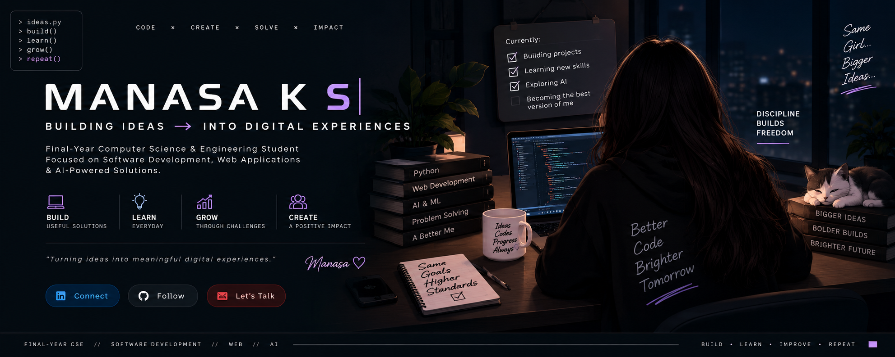
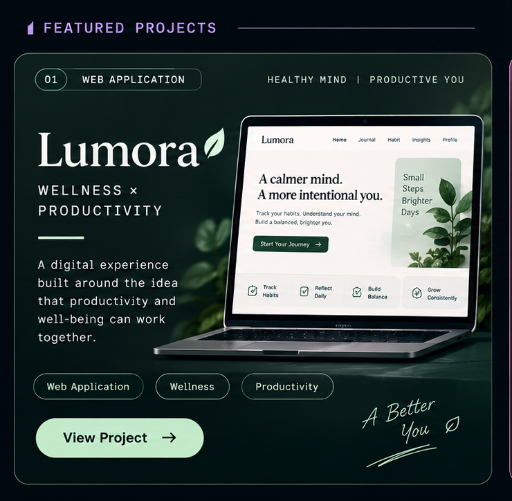
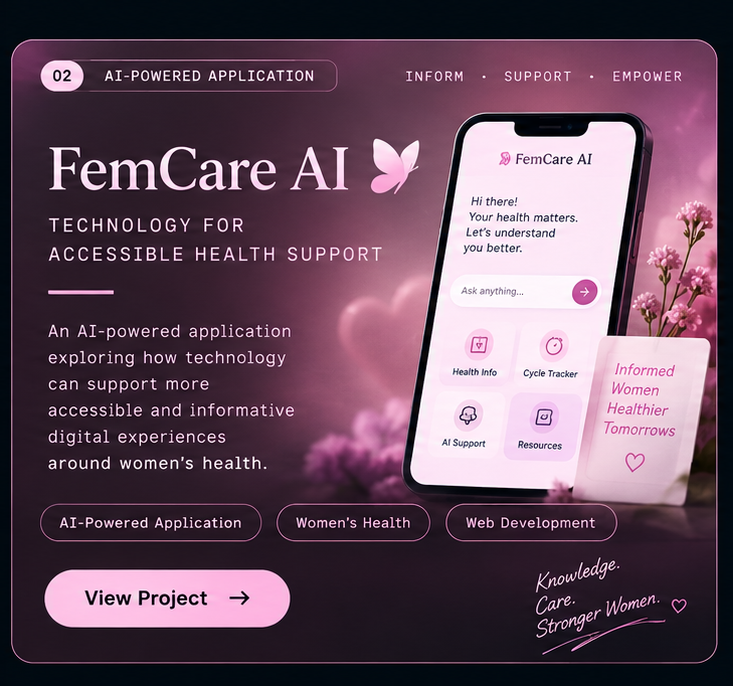
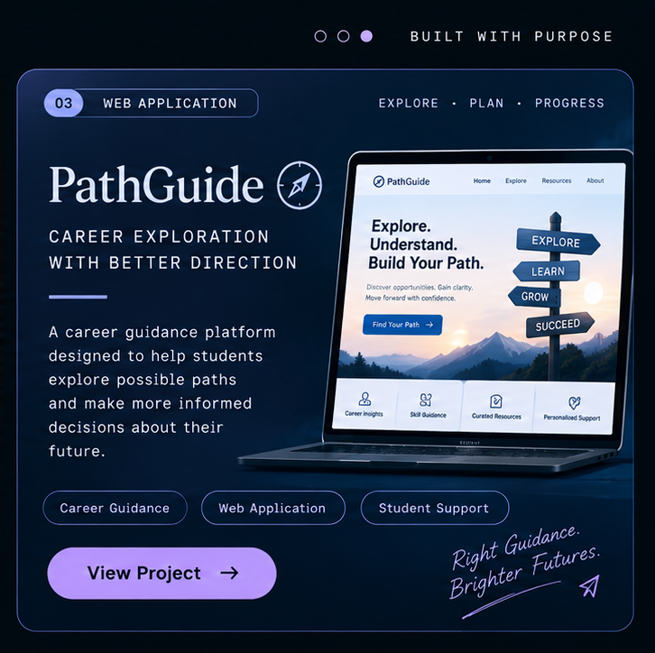

  

# MANASA K S
### Aspiring Software Developer

I enjoy turning ideas into practical web applications and exploring how technology can create meaningful impact.  
Currently focused on **building, learning, and growing**.

`Web Development` · `Python` · `AI-Powered Solutions` · `Problem Solving`

 

 

## 01 / Currently in Progress

- 🛠️ Building and improving my projects
- 🐍 Strengthening Python and development skills
- 🤖 Exploring AI/ML and real-world applications
- 🚀 Preparing for software development opportunities

> A little progress every day adds up.

---

## 02 / The Build Board

<table>
<tr>

<td width="33%" valign="top" align="center">

  

### 🌿 Lumora

Wellness and productivity, brought into one experience.

`Web App` · `Wellness`

[View Code →](https://github.com/Manasa03042004)

</td>

<td width="33%" valign="top" align="center">

  

### 💗 FemCare AI

AI-powered women's health application.

`AI/ML` · `HealthTech`

[View Code →](https://github.com/Manasa03042004)

</td>

<td width="33%" valign="top" align="center">

  

### 🧭 PathGuide

Career guidance platform for students.

`Web App` · `Career`

[View Code →](https://github.com/Manasa03042004)

</td>

</tr>
</table>

---

## 03 / Behind the Build

| Project | The question that started it |
|---|---|
| 🌿 **Lumora** | *"What if productivity also made space for well-being?"* |
| 💗 **FemCare AI** | *"How can AI make women's health support more accessible?"* |
| 🧭 **PathGuide** | *"Can technology make career exploration less overwhelming?"* |

---

## 04 / My Developer Toolkit

<table>
<tr>

<td valign="top">

### Languages

</td>

<td valign="top">

### Web

</td>

<td valign="top">

### Tools

</td>

<td valign="top">

### Exploring

</td>

</tr>
</table>

---

## 05 / Growth Log

<b>2026</b> — Building and publishing personal projects

 

- Building and improving personal projects
- Strengthening software development skills
- Preparing for developer opportunities
- Continuing to explore practical AI and web applications

<b>2025</b> — Internship & real-world projects

 

- Completed internship experience
- Worked on real-world projects
- Gained practical experience in web development
- Improved collaboration and project-building skills

<b>2024</b> — Exploring new technologies

 

- Explored new technologies and development concepts
- Started turning project ideas into applications
- Developed a stronger interest in AI and its applications

<b>2023 & before</b> — Building a foundation

 

- Built a foundation in computer science and programming
- Participated in technical and cultural events
- Took on team and volunteer responsibilities
- Always curious, always learning

---

## 06 / GitHub Pulse

 

---

## 07 / Where I'm Going

Currently focused on growing as a **Software Developer** and building practical, meaningful applications. I'm looking forward to contributing to impactful work, learning from real-world experiences, and creating technology that adds value.

---

## 08 / Let's Connect

  

*Thank you for visiting! ✨*

